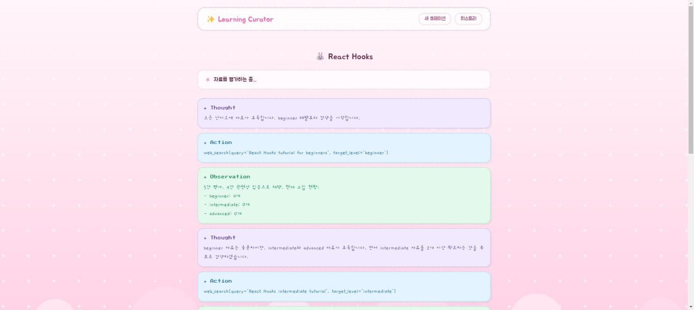
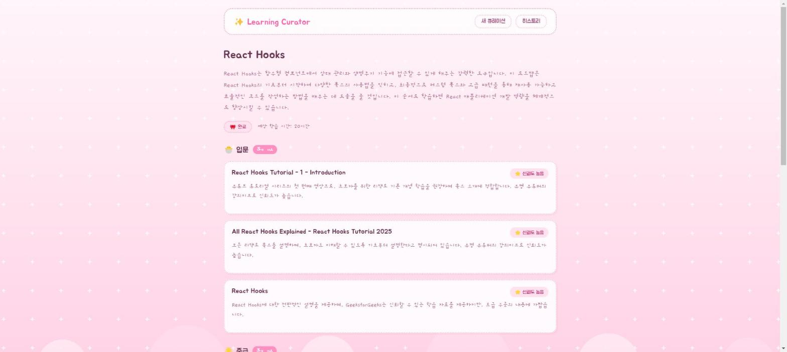

# 🧭 Learning Curator

**관심 주제를 입력하면, AI 에이전트가 직접 웹을 검색하고 평가하며 난이도별 학습 로드맵을 만들어주는 개인 학습 콘텐츠 큐레이터입니다.**

단순히 LLM에게 "React Hooks 배우는 법 알려줘"라고 물어보면 그럴듯하지만 실제로는 존재하지 않는 링크를 추천받는 경우가 많습니다. 이 프로젝트는 **ReAct(Thought → Action → Observation) 패턴**으로 LLM이 실제 웹 검색 결과에 근거해서만 자료를 추천하도록 강제하고, 그 판단 과정 자체를 사용자에게 실시간으로 보여주는 것을 목표로 만들었습니다.

🔗 **라이브 데모**: https://frontend-production-c5ba.up.railway.app (Railway 배포, 백엔드는 [`docs/DEPLOY.md`](./docs/DEPLOY.md) 참고)

> ⚠️ 데모는 Gemini **무료 티어** 키로 떠 있어 `gemini-2.5-flash` 기준 하루 20회 요청 제한이 있습니다. 제한에 걸리면 큐레이션이 "실패" 상태로 뜰 수 있는데, 이 경우도 §트러블슈팅 노트에서 설명하는 것처럼 `run_logs`에 사유가 남고 사용자에게는 에러 화면 + 재시도 버튼이 정상적으로 노출됩니다.

## ✨ 한눈에 보기

- 🔎 **직접 검색하는 에이전트** — LLM이 스스로 "무엇을 더 검색해야 할지" 판단하고, 실제 검색 결과만 가지고 로드맵을 작성합니다.
- 🛡️ **Hallucination 방지 설계** — 최종 결과의 모든 URL은 실제 검색 Observation에 있던 값인지 코드 레벨에서 검증합니다. 하나라도 지어낸 URL이 섞이면 그 즉시 검증 실패로 처리하고 재시도합니다.
- 👀 **생각의 과정을 그대로 노출** — Thought/Action/Observation 각 단계를 저장해 타임라인으로 보여줍니다. "왜 이 자료를 추천했는지"가 아니라 "어떻게 검색해서 찾았는지"까지 보입니다.
- 🔄 **LLM 프로바이더를 하루 만에 교체** — 원래 Anthropic Claude로 구현했다가, 이후 Gemini로 전량 교체했습니다. tool-calling 스키마를 프로바이더 중립적으로 설계해둔 덕분에 `_call_tool()` 한 곳만 고치면 됐습니다.

## 📸 실행 화면

| 주제 입력 | 진행 상황 (ReAct 타임라인) | 결과 |
|---|---|---|
|  |  |  |

> 위 결과 화면은 실제로 "React Hooks"를 입력해 얻은 라이브 결과입니다. ReAct 3회전(beginner → intermediate → advanced 순으로 스스로 검색 전략을 세움) 끝에, **첫 시도에 출력 계약을 통과**(재시도 0회)하고 29.5초·8,724토큰 만에 실제 자료 9개로 로드맵을 완성했습니다.
>
> UI는 카카오톡 파스텔 테마에서 영감을 받아 픽셀 별·구름 배경, 도트 테두리 카드, 말풍선 스타일 타임라인으로 꾸몄습니다. Thought/Action/Observation 3단계를 색으로 구분해야 하는 요구사항(§9)을 "채팅 타임라인"이라는 익숙한 은유로 풀어본 것입니다.

## 🏗️ 아키텍처

```mermaid
sequenceDiagram
    participant U as 사용자
    participant FE as React (Vite)
    participant BE as FastAPI
    participant LLM as Gemini
    participant WEB as Tavily
    participant DB as PostgreSQL

    U->>FE: 학습 주제 입력
    FE->>BE: POST /api/curate
    BE->>DB: roadmap(status=running) 생성
    BE-->>FE: { roadmap_id }
    FE->>BE: GET /roadmaps/:id/steps (1.5s 폴링)

    loop ReAct 루프 (최대 5회, 토큰 예산 내)
        BE->>LLM: Thought — 다음에 뭘 검색할지 결정
        LLM-->>BE: decide_next_search(query, target_level)
        BE->>WEB: Action — web_search(query)
        WEB-->>BE: 제목 / URL / 스니펫
        BE->>LLM: Observation — 난이도·신뢰도 평가
        LLM-->>BE: evaluate_results(...)
        BE->>DB: react_steps 저장 (프론트가 폴링으로 읽어감)
    end

    BE->>LLM: 최종 로드맵 생성 (함수 호출 강제)
    LLM-->>BE: generate_roadmap(...)
    BE->>BE: Pydantic 검증 + URL 화이트리스트 검사
    alt 검증 실패
        BE->>LLM: 실패 사유를 피드백으로 재요청 (최대 2회)
    end
    BE->>DB: 최종 결과 저장 (success / partial / failed)
    FE->>U: 결과 화면 표시
```



## 🧠 기술적으로 신경 쓴 부분

**1. 출력 계약(Output Contract)으로 Hallucination을 코드로 차단**

LLM에게 "실제로 검색한 URL만 써줘"라고 프롬프트로 부탁하는 것만으로는 못 믿습니다. 그래서 검색 Observation에서 나온 URL을 화이트리스트로 따로 모아두고, 최종 로드맵의 모든 URL을 이 집합과 대조합니다.

```python
# backend/app/schemas/roadmap.py
def validate_urls_against_allowlist(self, allowed_urls: set[str]) -> None:
    used = {resource.url for block in self.levels for resource in block.resources}
    hallucinated = used - allowed_urls
    if hallucinated:
        raise ValueError(f"urls not found in search observations: {sorted(hallucinated)}")
```

여기 걸리면 실패 사유를 그대로 다음 프롬프트에 피드백으로 넣어 재생성을 요청하고(`build_retry_feedback_prompt`), 그래도 실패하면 LLM 재생성 없이 **수집된 자료를 코드로 직접 조립**해 `partial` 결과를 돌려줍니다 — 사용자에게 "일부 자료만 확인됨"이라도 보여주는 게, 아무것도 안 주는 것보다 낫다는 판단입니다.

**2. LLM 호출을 강제 함수 호출로만 받기**

Thought/Observation/최종 생성 세 단계 모두 자유 텍스트를 파싱하지 않습니다. Gemini의 `tool_config`를 `mode="ANY"` + `allowed_function_names`로 강제해서, 모델이 항상 우리가 정의한 JSON 스키마로만 응답하게 만들었습니다. 덕분에 "모델이 마크다운 코드블록으로 감싸서 응답해서 파싱이 깨지는" 류의 문제가 아예 발생하지 않습니다.

**3. 컨트롤러가 종료 조건의 최종 결정권을 가짐**

실제 라이브 실행 로그를 보면, 모델이 스스로 "advanced 자료가 최소 5개는 필요하다"고 (틀리게) 판단한 순간이 있었습니다. 하지만 실제 종료 조건(`_enough_collected()`, 레벨당 최소 2개)은 모델이 아니라 컨트롤러 코드가 갖고 있어서, 모델의 착각과 무관하게 정상적으로 다음 단계로 넘어갔습니다. **LLM의 판단은 참고하되, 종료·재시도 같은 안전장치는 항상 코드가 쥐고 있어야 한다**는 걸 실제로 확인한 부분입니다.

**4. 프로바이더 교체에 하루밖에 안 걸린 이유**

애초에 tool 스키마를 `{name, description, input_schema}` 형태의 순수 dict로 정의해두고, `_call_tool()` 내부에서만 특정 SDK(처음엔 Anthropic, 지금은 `google-genai`)로 변환하도록 격리해뒀습니다. 그래서 LLM을 통째로 바꿀 때도 `react_loop.py`의 임포트문과 `_call_tool()` 메서드, `config.py`의 필드 이름만 고치면 됐고, 프롬프트·스키마·검증 로직·DB·프론트엔드는 한 줄도 건드리지 않았습니다.

## 🔧 트러블슈팅 노트

실제로 겪었던 문제와 원인, 해결 과정입니다. (전체 빌드 로그는 [`PROGRESS.md`](./PROGRESS.md) 참고)

<details>
<summary><b>Docker의 Postgres 컨테이너에 연결이 안 됨 — 근데 컨테이너는 healthy</b></summary>

<br>

`asyncpg`로 `127.0.0.1:5432`에 연결하면 매번 `ConnectionDoesNotExistError`가 났습니다. 컨테이너는 `healthy` 상태였고, `docker exec`로 들어가서 직접 쿼리하면 멀쩡했습니다.

원인을 좁혀나간 과정: raw socket으로 직접 핸드셰이크를 보내봐도 재현됨 → `asyncpg` → `psycopg`로 드라이버를 바꿔도 재현됨 → 의심 방향을 네트워크 레이어로 전환 → `Get-NetTCPConnection -LocalPort 5432`로 실제 포트 소유자를 확인.

**원인**: 이 PC에 이미 네이티브 Windows Postgres가 `0.0.0.0:5432`를 점유하고 있었고, Docker Desktop의 컨테이너 포워딩(`::` IPv6)보다 먼저 요청을 가로채고 있었습니다. `127.0.0.1` 연결은 항상 컨테이너가 아니라 이 로컬 Postgres로 가고 있었던 것.

**해결**: `docker-compose.yml`의 호스트 포트를 `5434`로 변경.

</details>

<details>
<summary><b>Gemini에게 강제 함수 호출을 시켰는데 실제로 스키마가 먹힐지 확신이 없었음</b></summary>

<br>

Anthropic 스타일로 짜둔 JSON 스키마(`{"type": "object", "properties": {...}}`)를 Gemini의 `FunctionDeclaration.parameters`에 그대로 넣어도 되는지 문서만으로는 100% 확신이 안 섰습니다. 추측 대신 실제 키로 최소 재현 스크립트를 먼저 돌려서, 소문자 JSON-schema 스타일 dict가 변환 없이 그대로 먹힌다는 것과 `function_call.args`가 이미 평범한 Python dict로 온다는 것을 라이브로 확인한 뒤에 본 코드에 반영했습니다.

</details>

<details>
<summary><b>Gemini가 간헐적으로 503, 그리고 무료 티어는 하루 20회 제한</b></summary>

<br>

라이브 테스트 중 `503 UNAVAILABLE`(모델 과부하)이 종종 발생해서 지수 백오프 재시도(최대 3회, 1s/2s)를 추가했습니다. 이후 테스트를 반복하다가 `429 RESOURCE_EXHAUSTED`를 만났는데, 에러 메시지에 `free_tier_requests, limit: 20`이 명시되어 있어 **Google AI Studio 무료 키는 `gemini-2.5-flash` 기준 일 20회 제한**이라는 걸 실사용 중 확인했습니다. 429는 재시도로 해결될 문제가 아니라서(쿼터 자체가 소진된 것) 503과는 별도로 그냥 실패 처리하고 `run_logs`에 사유를 남기도록 했습니다.

</details>

## 🛠️ 기술 스택

| 영역 | 선택 | 이유 |
|---|---|---|
| LLM | Google Gemini (`gemini-2.5-flash`) | function calling으로 구조화된 출력을 강제할 수 있고, `thinking_budget=0`으로 단순 판단 작업의 불필요한 사고 토큰을 끌 수 있음 |
| 웹 검색 | Tavily API | LLM 에이전트용으로 설계된 검색 API라 제목/URL/스니펫이 바로 쓰기 좋은 형태로 옴 |
| 백엔드 | FastAPI + SQLAlchemy(async) | 비동기 I/O(LLM 호출·웹검색·DB)가 많은 워크로드에 적합, Pydantic으로 출력 계약을 자연스럽게 강제 |
| DB | PostgreSQL (JSONB) | 로드맵 결과를 JSONB로 저장해두면 나중에 난이도별 필터링 같은 걸 SQL로 바로 할 수 있음 |
| 프론트엔드 | React (Vite) + React Query | 진행 상황 폴링·캐싱이 `useQuery`의 `refetchInterval`만으로 충분히 해결됨, 굳이 Redux 안 씀 |

## 🚀 실행 방법

### 사전 준비
- Python 3.11+, Node 18+, Docker Desktop
- API 키: [Google AI Studio](https://aistudio.google.com/) (Gemini) / [Tavily](https://tavily.com/)

### 1. PostgreSQL

```bash
docker compose up -d postgres
```

> 호스트 포트로 **5434**를 씁니다 (이유는 위 트러블슈팅 참고). 충돌이 없는 환경이라면 `docker-compose.yml`에서 5432로 바꿔도 무방합니다.

### 2. 백엔드

```bash
cd backend
python -m venv .venv
./.venv/Scripts/activate   # Windows PowerShell: .venv\Scripts\Activate.ps1
pip install -r requirements.txt
cp .env.example .env       # GEMINI_API_KEY / TAVILY_API_KEY 채워넣기
python -m alembic upgrade head
python -m uvicorn app.main:app --reload --port 8000
```

- `GET /health`로 기동 확인
- 웹 검색 도구만 단독 테스트: `python scripts/test_web_search.py "React Hooks tutorial"`

### 3. 프론트엔드

```bash
cd frontend
npm install
cp .env.example .env       # 기본값(http://localhost:8000) 그대로 둬도 됨
npm run dev
```

`http://localhost:5173` 접속 → 주제 입력 → 진행 화면 → 결과 화면.

## 📡 API

| Method | Path | 설명 |
|---|---|---|
| POST | `/api/curate` | `{ topic }` → `{ roadmap_id }`, 백그라운드로 ReAct 루프 실행 |
| GET | `/api/roadmaps/{id}` | 로드맵 상태/결과 조회 (프론트가 폴링) |
| GET | `/api/roadmaps/{id}/steps` | ReAct 단계별 로그 (Thought/Action/Observation) |
| GET | `/api/roadmaps` | 과거 로드맵 목록 |

## 📁 프로젝트 구조

```
backend/
├── app/
│   ├── agent/          # ReAct 컨트롤러, 웹검색 도구, 프롬프트
│   ├── api/             # FastAPI 라우트
│   ├── schemas/         # 출력 계약(Pydantic)
│   ├── db/              # SQLAlchemy 모델/세션
│   └── core/             # 설정(.env 로드)
├── alembic/              # DB 마이그레이션
└── scripts/              # web_search 단독 테스트 스크립트
frontend/
└── src/
    ├── pages/            # 입력/진행/결과/히스토리 화면
    ├── components/       # Timeline, ResourceCard, ConfidenceBadge
    └── api/               # 백엔드 API 클라이언트
```

## 🔭 앞으로 개선하고 싶은 점

- 사용자 로그인/인증, 로드맵 진행률 체크리스트 (원래 스펙에서도 스트레치 목표로 남겨둔 부분)
- LLM 판단 근거(Observation)를 프론트에서 자료별로 펼쳐볼 수 있게
- LangFuse 같은 관측 도구 연동으로 `run_logs`의 토큰/비용 통계를 대시보드로
- 다중 웹검색 소스(현재는 Tavily 단일 소스) 병행

## 📚 더 보기

- [`PROJECT_SPEC.md`](./PROJECT_SPEC.md) — 원 기획 스펙 문서
- [`PROGRESS.md`](./PROGRESS.md) — 빌드 로그 (Day별/기능별 진행 상황, 트러블슈팅 전체 기록)
- [`docs/DEPLOY.md`](./docs/DEPLOY.md) — Railway 배포 가이드
